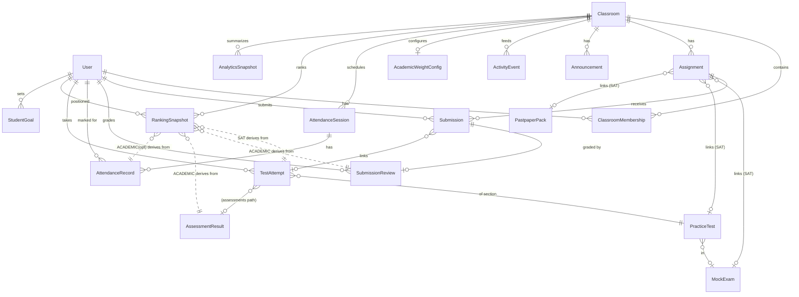

# MasterSAT Classroom — Business Architecture

Final design, grounded in the existing schema. Backend (models → services → APIs) is implemented from this; UI follows. Constants marked **(tunable)** are config, not magic values.

Legend for model decisions: **KEEP** (unchanged), **EXTEND** (add fields/migration), **NEW**, **MERGE**.

---

## 0. Foundational decision — two role layers

Authorization has two orthogonal layers; the rebuild keeps them separate and never conflates them:

- **Global RBAC** (`users.User.role` ∈ super_admin/admin/teacher/test_admin/student; `access.authorize(user, perm, subject=)`): controls who may create classrooms and access subject-scoped resources.
- **Classroom-local role** (`classes.ClassroomMembership.role`): controls capabilities *inside one classroom*.

"Teacher", "TA", "Student" are **not entities** — they are `ClassroomMembership.role` values. "Admin" is a global capability (`User.role ∈ {super_admin, admin}` or `is_superuser`) that overrides classroom-local checks. A person can be a Teacher in class A and a Student in class B.

`ClassroomMembership.role` (EXTEND) ∈ `OWNER | TEACHER | TA | STUDENT`.
- **OWNER** — the creator; everything a Teacher can do **plus** delete/transfer the class and manage Teachers. (In the 4-role permission matrix, OWNER and TEACHER are both shown under "Teacher"; owner-only cells are footnoted.)
- Migration: legacy `ADMIN` membership → `OWNER` for `classroom.created_by`, else `TEACHER`.

---

## 1. Domain model

### 1.1 Entities (with decision + key fields)

**Classroom** — EXTEND
`id, name, subject (ENGLISH|MATH|BOTH ← add BOTH), schedule fields, room_number, join_code (unique), is_active, created_by→User, created_at`. `max_students` retained but **never enforced** (no size limit). Owner is derived from the `OWNER` membership.

**ClassroomMembership** — EXTEND
`classroom→Classroom, user→User, role (OWNER|TEACHER|TA|STUDENT), status (ACTIVE|INVITED|REMOVED ← add), joined_at`. `unique(classroom, user)`. Soft-removal via `status=REMOVED` (preserve history for past grades/rankings).

**Assignment** — EXTEND
Existing resource links KEPT (`mock_exam, practice_test, pastpaper_pack, practice_test_pack, module, attachment_file, external_url, practice_scope`). Add:
- `category` (NEW) ∈ `HOMEWORK | CLASSWORK | QUIZ | PRACTICE_TEST | MOCK_EXAM | PAST_PAPER` — routes the result to a ranking (see §3.4). SAT-scored categories feed **SAT** (via TestAttempt); the rest feed **Academic** (via grades).
- `max_score` (NEW, Decimal, null) — points the work is out of; **required to normalize teacher grades** for Academic ranking. Null ⇒ not counted in Academic.

**Submission** — KEEP
`assignment→Assignment, student→User, status (DRAFT|SUBMITTED|RETURNED|REVIEWED), attempt→TestAttempt (null), submitted_at, returned_at`. Workflow state machine, revision lock, audit, throttles, dedup — all **preserved untouched**.

**Grade** — represented by two existing models, unified by a normalization rule (§3.4):
- **SubmissionReview** — EXTEND. `submission O2O, teacher→User, grade (Decimal, raw), max_score (NEW Decimal, defaults from Assignment.max_score), feedback, reviewed_at`. `normalized_percent` is **derived** = `clamp(100 * grade / max_score, 0, 100)`.
- **AssessmentResult** — KEEP (auto-graded). Already exposes `percent`, `score_points`, `max_points`.

**Announcement** — MERGE (replaces `ClassPost` + `ClassroomStreamItem`)
`classroom→Classroom, author→User, body, pinned (bool), created_at, edited_at`. Authored teacher/TA posts.
**ActivityEvent** (NEW, the unified feed) — `classroom, actor→User, kind (ANNOUNCEMENT|ASSIGNMENT_POSTED|SUBMISSION_GRADED|MEMBER_JOINED|ATTENDANCE_TAKEN|…), target_type, target_id, created_at`. The stream is read from ActivityEvent; announcements also emit one. `ClassComment` — KEEP, retargeted to Announcement/Assignment.

**AttendanceSession** — NEW (§4)
**AttendanceRecord** — NEW (§4)

**AcademicWeightConfig** — NEW (§3.2)
`classroom O2O, w_homework, w_quiz, w_classwork, w_participation, w_attendance (Decimals), missing_as_zero (bool, default false), updated_by, updated_at`.

**ClassroomRankingConfig** — NEW (§3.5) — per-classroom leaderboard visibility (applies to both SAT & Academic).
`classroom O2O, leaderboard_mode (FULL|ANONYMOUS|HIDDEN, default FULL), hide_score_values (bool, default false), updated_by, updated_at`.

**RankingSnapshot** — NEW (§3.3) — persists computed ranks/scores per cycle for history, rank-change, percentile, trend.
`classroom→Classroom, student→User, kind (SAT|ACADEMIC), scope (CLASSROOM), period_key (e.g. "2026-06-13" or cycle id), rank, previous_rank, score (Decimal), percentile (Decimal), components (JSON: section scores / category scores), computed_at`. Indexes: `(classroom, kind, period_key, rank)`, `(classroom, kind, student, period_key)`.

**StudentGoal** — NEW (analytics §5) — `student→User, classroom→Classroom (null=cohort), target_total (400–1600), target_date, created_at`. Stores user *intent*, not a computed aggregate.

*(No `AnalyticsSnapshot`.* Analytics are computed live from source tables + `RankingSnapshot` history — see §5. A denormalized cache is deliberately **not** built until a measured performance problem justifies it.)*

### 1.2 Relationships



**Ranking input boundary (invariant):** SAT reads only `TestAttempt` (SAT-scaled). ACADEMIC reads only `SubmissionReview`/`AssessmentResult`/`AttendanceRecord`. Neither crosses. SAT-scored assignments never count toward Academic (dedup, §3.4).

---

## 2. Permission matrix

Roles: **Admin** (global super_admin/admin/superuser), **Teacher** (membership OWNER or TEACHER), **TA** (membership TA), **Student** (membership STUDENT). `✓`=allowed, `—`=denied, `own`=only own data. †=OWNER-only (TEACHER denied). All teacher/TA actions are scoped to classrooms they're a member of; Admin is cross-classroom.

| Capability | Admin | Teacher | TA | Student |
|---|---|---|---|---|
| **Classroom** | | | | |
| View classroom | ✓ | ✓ | ✓ | ✓ |
| Create classroom | ✓¹ | ✓¹ | — | — |
| Edit settings (name/schedule/etc.) | ✓ | ✓ | — | — |
| Regenerate join code | ✓ | ✓ | — | — |
| Archive / set inactive | ✓ | ✓ | — | — |
| Delete classroom | ✓ | ✓† | — | — |
| Transfer ownership | ✓ | ✓† | — | — |
| **Roster** | | | | |
| View people | ✓ | ✓ | ✓ | ✓ |
| Add/remove students | ✓ | ✓ | ✓ | — |
| Assign/revoke TA | ✓ | ✓ | — | — |
| Add/remove Teachers | ✓ | ✓† | — | — |
| **Assignments** | | | | |
| View | ✓ | ✓ | ✓ | ✓ |
| Create / edit / delete | ✓ | ✓ | ✓ | — |
| **Submissions & grades** | | | | |
| Submit work | — | — | — | ✓ |
| View own submission | — | — | — | ✓ own |
| View all submissions | ✓ | ✓ | ✓ | — |
| Grade / return for revision | ✓ | ✓ | ✓ | — |
| View submission audit log | ✓ | ✓ | ✓ | own |
| **Announcements / stream** | | | | |
| View stream | ✓ | ✓ | ✓ | ✓ |
| Post / edit / delete announcement | ✓ | ✓ | ✓ | — |
| Comment | ✓ | ✓ | ✓ | ✓ |
| **Attendance** | | | | |
| View own attendance | — | — | — | ✓ own |
| View class attendance | ✓ | ✓ | ✓ | — |
| Create session / mark / edit | ✓ | ✓ | ✓ | — |
| Export attendance | ✓ | ✓ | ✓ | — |
| **Rankings** | | | | |
| View own rank (SAT + Academic) | — | — | — | ✓ own |
| View full class rankings | ✓ | ✓ | ✓ | ✓² |
| Configure Academic weights | ✓ | ✓ | — | — |
| Trigger recompute | ✓ | ✓ | — | — |
| **Analytics** | | | | |
| View personal analytics | — | — | — | ✓ own |
| View class analytics | ✓ | ✓ | ✓ | — |
| Export analytics | ✓ | ✓ | ✓ | — |

¹ Gated by global `authorize(user, PERM_CREATE_CLASSROOM, subject=<platform>)`.
² Students see class rankings **anonymized except their own row** by default (config `rankings_visible_to_students`, default leaderboard-on, names-on — tunable per class). Growth-oriented: no "bottom rank" emphasis in UI.

**Enforcement:** a single `classroom_capabilities(user, classroom)` service returns the capability set (mirrors frontend `capabilities.ts`); DRF permission classes (`CanManageClass`, `CanGrade`, `CanTakeAttendance`, `IsClassMember`) consume it. Admin override is checked first. No inline role-string comparisons in views.

---

## 3. Ranking architecture

Two **independent** engines (`classes/ranking/sat.py`, `classes/ranking/academic.py`) behind a common `RankingService`. Both write `RankingSnapshot` rows. Scope = per classroom (an optional global/cohort scope is a later phase).

### 3.1 SAT Ranking (SAT performance only)

A weighted **performance model** on the 400–1600 composite scale:
```
SAT Score = 0.50 · RecentForm + 0.30 · PeakAbility + 0.20 · Consistency      (weights tunable)
```

**Eligible inputs:** completed `TestAttempt` rows (`current_state=COMPLETED`, `score` not null) for the classroom's students, parent activity SAT-scaled: `MOCK_SAT` sections, `PastpaperPack`/`PracticeTestPack` sections, midterm `SCALE_800`. **Excluded:** midterm `SCALE_100`, incomplete/abandoned attempts.

**Composite (one SAT event, 400–1600):** pair the student's R&W + Math section attempts sharing the same parent (`mock_exam`/`pastpaper_pack`/`practice_test_pack`); each section clamped to `[200,800]`; `composite = rw + math`. Requires **both** sections completed. Single-section parents are excluded from ranking (used only for section trend display).

Let a student's eligible composites be `c₁ … cₙ` ordered newest→oldest with ages `aᵢ` (days). **Time-decay** `D(a) = 0.5^(a / HALF_LIFE_DAYS)`, `HALF_LIFE_DAYS = 180` (tunable) — old scores decay.

**RecentForm (50%)** — recency-weighted average of the last `k = min(5, n)` composites (≥3 desired), newer weighted higher, with time-decay:
```
wᵢ = λ^(i-1) · D(aᵢ)        for i = 1..k   (i=1 = newest), λ = 0.70 (tunable)
RecentForm = Σ wᵢ·cᵢ / Σ wᵢ
```

**PeakAbility (30%)** — highest composite achieved within the last 6 months (182 days):
```
PeakAbility = max{ cᵢ : aᵢ ≤ 182 }      ; if none in window → max{ cᵢ · D(aᵢ) } (decayed fallback)
```

**Consistency (20%)** — rewards stable, near-peak performance. Over the recent set `R = {c₁ … c_k}`:
```
σ = population stdev(R)
Consistency = clamp( mean(R) − VOL_PENALTY · σ , 400, 1600 )    VOL_PENALTY = 1.0 (tunable)
```
High when recent scores are both high and tightly clustered (low volatility); a volatile student is pulled below their mean.

**Confidence** — from completed-event count `n` (a single trusted score needs enough data):
```
n = 0                    → UNRANKED (excluded from N; shown "no SAT score yet")
1 ≤ n < MIN_TRUSTED(=3)  → score computed but flagged PROVISIONAL / LOW
n = 3–4                  → MEDIUM
n ≥ FULL_TRUST_N(=5)     → HIGH
confidence_ratio = clamp(n / FULL_TRUST_N, 0, 1)
```
(MIN_TRUSTED, FULL_TRUST_N tunable.) Provisional scores still rank but are visibly marked.

**Trend (tracked separately from score)** — least-squares slope of `cᵢ` over the last `min(6, n)` events by date:
```
slope > +ε  → IMPROVING ;  slope < −ε → DECLINING ;  else STABLE     ε = 5 pts/event (tunable)
```

**Ranking & ties:** order by `SAT Score` desc; ties → higher PeakAbility → more recent `completed_at` → lower user id.

**Percentile** (self-exclusive, share of ranked peers at/below):
```
N = ranked students (n ≥ 1)
percentile = round( 100 · (count(score < mine) + 0.5·count(score == mine, excl self)) / (N − 1), 1 )   # N==1 → 100.0
```

**Stored per snapshot (`RankingSnapshot.components`, also the ranking-page display fields):**
`{ sat_score, best (overall max composite), latest (c₁), recent_form, peak_ability, consistency, trend, slope, percentile, rank_change, confidence, confidence_ratio, events_count, rw_section, math_section }`. `previous_rank`/`rank_change` from the prior snapshot. The per-event composite series powers the growth chart.

### 3.2 Academic Ranking (overall standing)

**Hybrid model — performance scaled by completion:**
```
Academic Score = PerformanceScore · CompletionFactor          (0–100)
```

**PerformanceScore (0–100)** — weighted average of *graded* work, by category. Each item normalized to percent:
- Graded `SubmissionReview` (non-SAT) → `clamp(100*grade/max_score, 0, 100)` (needs `Assignment.max_score`; else skipped + logged).
- `AssessmentResult.percent` for auto-graded assessments/quizzes.
```
category_score(c) = mean(normalized percent of graded items in c)
PerformanceScore  = Σ_active( normalized_weight(c) · category_score(c) )
```
Categories: `HOMEWORK, QUIZ, CLASSWORK, PARTICIPATION` (+ `ATTENDANCE` from §4 when weighted). Only categories with weight > 0 **and** ≥1 graded item are active; their weights renormalize to sum 1 (empty categories don't deflate the score). Configurable teacher weights (`AcademicWeightConfig`, tunable defaults): `w_homework=0.35, w_quiz=0.30, w_classwork=0.20, w_participation=0.15, w_attendance=0.00`. Validation: each ≥ 0, at least one > 0.

**CompletionFactor (0.50–1.00)** — from the share of assigned work the student has completed:
```
completion = completed_items / assigned_items      (items due/visible to the student)
   completed = Submission in {SUBMITTED, REVIEWED} OR AssessmentAttempt in {submitted, graded}
```
Piecewise-linear from anchor table (tunable), interpolated, floored at 0.50:
```
completion → factor :  1.00→1.00  0.95→0.98  0.90→0.95  0.80→0.90  0.70→0.80
below 0.70: extend the 0.70–0.80 slope (Δ0.10 factor per Δ0.10 completion) down to a 0.50 floor
no assigned items yet → factor = 1.00 (don't penalize an empty class)
```

**Missing/late surfaced separately** (never silent zeros): `missing_count`, `late_count`, `completion_rate` are reported in analytics + the ranking row, distinct from the score. **Teacher opt-in** `missing_as_zero` (per classroom, default off): when on, past-due ungraded items enter PerformanceScore as 0 and **CompletionFactor is fixed to 1.00** (avoid double-penalty).

**Ranking, ties, percentile, history:** identical mechanism to SAT, `kind=ACADEMIC`. Tie-breakers: higher PerformanceScore → higher completion → lower user id. `components` JSON stores `{ performance_score, completion_factor, completion_rate, category_scores, applied_weights, missing_count, late_count, trend, rank_change, percentile }`.

### 3.3 Computation & persistence

- **Service API:** `RankingService.recompute(classroom_id, kind=ALL)` → upserts `RankingSnapshot` rows for a new `period_key`.
- **Triggers:** (a) incremental — on `TestAttempt` completion (SAT) and on `SubmissionReview`/`AssessmentResult` write (Academic) via signals → enqueue async recompute for that classroom (debounced); (b) daily snapshot job (Celery beat / management command + cron) writes a dated `period_key` for every active classroom to build clean history; (c) manual recompute endpoint for teachers/admin.
- **Scale:** recompute is O(members) with a few indexed aggregate queries; snapshots make reads O(1). No per-request ranking math.

### 3.4 SAT/Academic dedup rule

An assignment whose `category ∈ {PRACTICE_TEST, MOCK_EXAM, PAST_PAPER}` produces a SAT `TestAttempt` → **SAT only**, never Academic (even if a teacher also leaves a SubmissionReview, it's ignored by Academic). `category ∈ {HOMEWORK, QUIZ, CLASSWORK, PARTICIPATION}` → **Academic only**. This guarantees no activity is double-counted across the two systems.

### 3.5 Leaderboard visibility (per classroom)

`ClassroomRankingConfig` controls what students see (teacher/owner sets it; default = full):
- `leaderboard_mode`: **FULL** (rank + real name + score + change + trend), **ANONYMOUS** (others shown as "Student #N", the viewer's own row named), **HIDDEN** (student sees only their own rank/percentile/trend, no list).
- `hide_score_values`: independent toggle — show rank positions, change and trend but **omit numeric scores** (works with FULL/ANONYMOUS).

Each student row (SAT or Academic) exposes: **Rank, Name, Score, Rank change, Trend** (+ SAT adds Best, Latest, Percentile, Confidence). The viewer's own row is always highlighted and always shows their own score regardless of `hide_score_values`. Staff/Admin always see the full named leaderboard with scores. Applies identically to both ranking kinds.

---

## 4. Attendance architecture

**Models:**
- `AttendanceSession` (NEW): `classroom→Classroom, date (Date), title (e.g. "Lesson 12 — Linear eq."), lesson_index (int, null), created_by→User, status (OPEN|FINALIZED), created_at`. One session per lesson; uniqueness advisory on `(classroom, date, lesson_index)`.
- `AttendanceRecord` (NEW): `session→AttendanceSession, student→User, status (PRESENT|ABSENT|LATE|EXCUSED), note (str), marked_by→User, marked_at`. `unique(session, student)`.

**Flow:** Teacher/TA creates a session → records are **lazily** created on first mark (absence of a record = "not taken", not "absent"). A single **bulk upsert** endpoint marks/updates many students at once (`POST …/attendance/sessions/{id}/mark` with `[{student_id, status, note}]`). `FINALIZED` locks a session against further edits except by Admin/Owner.

**Attendance score (feeds Academic §3.2 + analytics), (tunable):**
```
counted sessions = FINALIZED sessions with ≥1 record
weight: PRESENT=1.0, LATE=0.5, ABSENT=0.0; EXCUSED excluded from denominator
attendance_score = 100 * Σ(weight) / (counted sessions where student is not EXCUSED)
```

**Permissions:** Admin/Teacher/TA create/mark/edit/export; Student views own only (see matrix). **SAT ignores attendance entirely.**

**Edge cases:** late-enrolled students only counted from `membership.joined_at` onward; removed students retain historical records; editing a finalized session is Admin/Owner-only and writes an `ActivityEvent`.

### 4.1 Attendance → Academic Ranking integration (exact contract)

Attendance affects **only** the Academic ranking, and **only** through one channel: the
`ATTENDANCE` category of `PerformanceScore` (§3.2). It never touches SAT, and it never
touches the `CompletionFactor` (completion is about assignment completion, not attendance —
attendance is treated as graded *performance*, so it is not double-counted).

1. **Is it on by default? No.** `AcademicWeightConfig.w_attendance` defaults to **0.00**.
   While the weight is 0, attendance has **zero** effect on Academic rank — exactly like an
   ungraded category. Attendance can be recorded and analyzed independently of ranking.
2. **Teacher-configurable: yes.** A Teacher/Owner/Admin sets `w_attendance` (≥ 0) via the
   ranking config. Setting it > 0 makes `ATTENDANCE` an active category; saving triggers a
   recompute. TAs and students cannot change it (§2).
3. **The category score** for a student is their `attendance_score` (0–100) from §4:
   `100 · Σ weight(status) / (counted, non-EXCUSED sessions)`, where PRESENT=1.0, LATE=0.5,
   ABSENT=0.0 and EXCUSED is excluded from the denominator. This single value is the
   `category_score("ATTENDANCE")` — there is no per-session averaging beyond this ratio.
4. **Activation rule.** `ATTENDANCE` becomes active in `PerformanceScore` only when both
   `w_attendance > 0` **and** the student has ≥ 1 counted session. Active weights renormalize
   to sum 1 (§3.2), so a student with no finalized sessions is ranked on their other
   categories alone — attendance neither helps nor penalizes them until data exists.
5. **Worked example.** Weights homework 0.35, attendance 0.15 (others 0); student has
   homework 80 and attendance 90. Active weights renormalize to homework 0.70 / attendance
   0.30 → PerformanceScore = 0.70·80 + 0.30·90 = 83.0, then × CompletionFactor.

This is the entire effect of attendance on ranking; everything else attendance produces
(history, trend, percentages) is analytics-only.

---

## 5. Analytics architecture

**Hard rule — real measured data only.** Every number is a count, mean, ratio, or historical series of recorded rows. **No** AI insights, predictions, risk scores, learning/success/health indices, estimated SAT scores, goal projections, or any synthetic/composite metric. If a value can't be traced to a source row, it isn't shown.

**Approach:** an `analytics` service computes **live** from source tables (`Submission`, `SubmissionReview`, `AttendanceRecord`, `TestAttempt`, `AssessmentResult`, `Question`) plus `RankingSnapshot` for score/rank history. Indexed aggregate queries. **No `AnalyticsSnapshot`, no cache tables.** Add a short-TTL response cache only if a measured bottleneck appears.

**Student cards → source:** SAT Score Trend & Academic Score Trend (`RankingSnapshot.score` series per kind); Ranking History (`RankingSnapshot.rank`); Attendance Rate (`AttendanceRecord`, §4); Completion Rate (`Assignment`+`Submission`); Best/Latest SAT (`RankingSnapshot(SAT).components.best/latest`); Recent Performance (recent `SubmissionReview`/`AssessmentResult` grades + recent `TestAttempt` scores); Assignment Completion History (`Assignment`+`Submission`+grades).

**Teacher cards → source:** Class Avg SAT / Academic (mean of latest `RankingSnapshot.score` per kind); Assignment Completion Rates & Submission Rates (`Assignment`+`Submission`+roster); Attendance Trends (§4 per-session present-rate); Score Distribution (histogram of latest `RankingSnapshot.score`); Ranking Distribution (counts by `RankingSnapshot.trend`); Improvement Trends (% of students with latest score > previous, from snapshot history; class avg delta); Strongest/Weakest **Topics** = accuracy by **Reading / Writing / Math** only — computed from real per-question correctness (`TestAttempt.module_answers` vs `Question.correct_answers`, grouped by `Question.question_type`). No finer topic tags exist in the schema, so none are invented.

**Endpoints (read-only):** `GET …/analytics/class` (staff), `GET …/analytics/me` (member, own), `GET …/analytics/students/{id}` (staff or self). Computed live; no snapshot persistence.

---

## 6. Implementation order (backend-first)

1. **Migrations & models** — ClassroomMembership roles+status; Assignment.category+max_score; SubmissionReview.max_score; AttendanceSession/Record; AcademicWeightConfig; ClassroomRankingConfig; RankingSnapshot; StudentGoal. (Announcement/ActivityEvent merge and the ADMIN→OWNER data migration are deferred — `ADMIN` is kept as the legacy owner value, capability layer treats ADMIN ≡ OWNER, per §0.)
2. **Capability service** + DRF permission classes (replace inline checks).
3. **Ranking services** (sat, academic) + signals + daily job + recompute endpoint.
4. **Attendance** service + bulk API.
5. **Analytics** service + snapshot job + endpoints.
6. **API surface** wired into `classes/urls.py`; OpenAPI updated.
7. Tests at each step (preserve the existing security/replay matrix); then UI follows.

---

## 7. Homework lifecycle & grading

**Assignment lifecycle** (`Assignment.status`): `DRAFT` (authoring; invisible to students; counts nowhere) → `PUBLISHED` (live; counts) → `ARCHIVED` (retired; hidden from active lists; existing grades retained but dropped from the completion/"missing" denominator). Visibility is enforced server-side (students see PUBLISHED only). Lifecycle endpoints: `assignments/<id>/publish|archive|unarchive/` (staff-gated).

**Submission lifecycle** (per student, unchanged): `DRAFT → SUBMITTED → REVIEWED (=Graded)`; `SUBMITTED/REVIEWED → RETURNED (=Needs Revision) → SUBMITTED`.

**Manual vs auto grading.** `Assignment.is_auto_graded` is true when the work is objective — practice tests, past papers, mock exams, module tests, or quizzes/assessments. On completion these are **auto-graded**: the system creates the submission + a `SubmissionReview(is_auto=True)` (grade = total scaled score, or assessment percent /100), moves the submission **straight to REVIEWED**, and surfaces the score in the gradebook/roster immediately. Auto-graded work **never** enters "Needs grading" (which = `status=SUBMITTED` on non-auto assignments). A human teacher grade (`is_auto=False`) is never overwritten by auto-grading. Only file/instruction assignments require manual grading.
